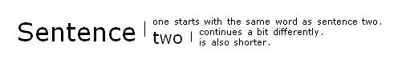
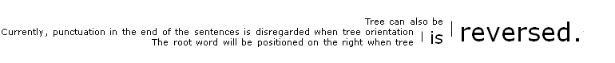
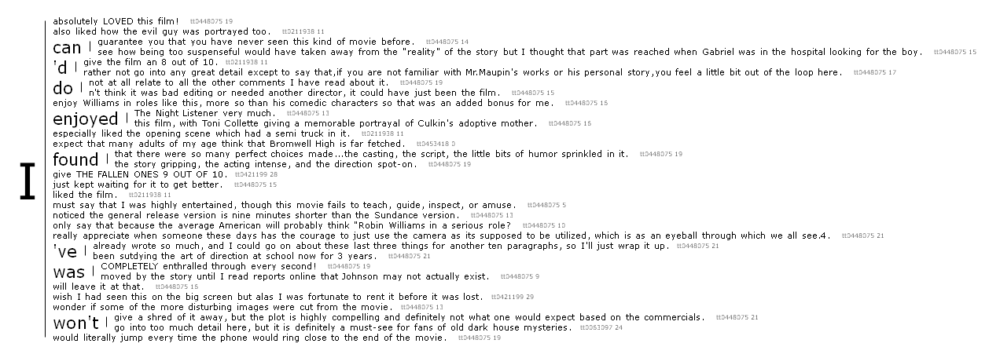

# text_tree

Simple tool to visualize text trees in Python.
Developed in Python 3.6.

## Installation notes
text_tree uses spacy to segment sentences and words, ete3 to build and visualize trees, and matplotlib for colours.

## Usage

```python
from text_tree import text_tree
texts = ['Sentence one starts with the same word as sentence two. Sentence two continues a bit differently. Sentence two is also shorter. Last sentence does not meet criteria for root word.']
t, s = text_tree.draw_tree(texts, [{'LOWER': 'sentence'}], 'simple_example.png')
```



```python
from text_tree import text_tree
texts = ['Tree can also be reversed. The root word will be positioned on the right when tree is reversed. Currently, punctuation in the end of the sentences is disregarded when tree orientation is reversed.']
t, s = text_tree.draw_tree(texts, [{'LOWER': 'reversed'}], 'simple_example_reversed.png', reverse=True)
```



```python
from text_tree import text_tree
texts = ['Tree can also be reversed. Tree root word will be positioned on the right when tree is reversed. Currently, punctuation in the end of the sentences is disregarded when tree orientation is reversed.',
'Tree nodes can be highlighted. Tree nodes can have annotations indicating their source/reference.']
t, s = text_tree.draw_tree(texts, [{'LOWER': 'tree'}], 'simple_example_highlights_refs.png', highlights=['tree', 'can', 'revers'], doc_refs=['first document', 'second document'])
```


```python
from text_tree import text_tree
import textacy.datasets

ds = textacy.datasets.IMDB()
ds.download()
texts = []
refs = []
for i, record in enumerate(ds.records(limit=30)):
    texts.append(record.text.replace('\n', ''))
    refs.append('{} {}'.format(record.meta['movie_id'], i))

text_tree.draw_tree(
    texts,
    [{'LOWER': 'i'}],
    output_file='IMDB_tree.png',
    doc_refs=refs)
```



## Current issues
Text clean-up is not robust, input text should already be cleaned (e.g., \n removed, etc.).

## License
[MIT](https://choosealicense.com/licenses/mit/)